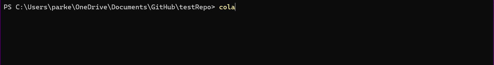
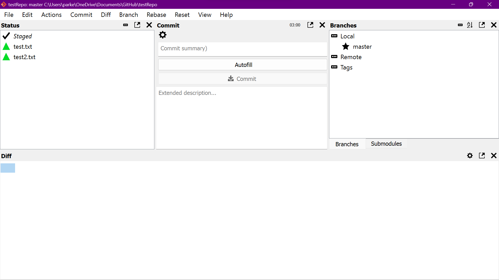

# My Journal #

## 10/4/2023 ##
Today I tried to package the project using the `pyinstaller` module. I was able to create a single executable file, but it didn't work. I don't know why.
I alos tried running py setup.py but it just packages the original git-cola project. I even tried running things like "py setup.py clean" and "py setup.py build" but it didn't work. 

## 10/5/2023 ##
Today I messed with the setup.py file that I somehow didn't see. I ran the command "py setup.py install" which installed the entire project as a package that can (I think) be distributed! so now if I go anywhere on my computer, I can use the "cola" command and it will pull up the gui with the autofill button.
Also, I made a small change to my prompt so now it knows the project name. I think I may add the project description to the prompt as well.

Here's me running the command in the terminal:

Here's the gui with the autofill button that comes from the command:

## 11/28/2023 ##
Talked to Seward and decided to find commit messages from a bad ass repo and use my ai to generate the messages and compare them. Found some commits to use.

## 12/04/2023 ##
Made diff_rester.py and used it to create a commit for the code and made a table with the human commit and the ai commit. grabbed a commit from react and used that
https://docs.google.com/document/d/1lZvX4UnyTsaAoKqmxYguq3sdK0egx9_RyjpqR_ltuX8/edit?usp=sharing 

## 12/05/2023 ##
developing an objective rubric for a "good commit"
here's what I have so far:

Title:
1: The title clearly describes the purpose of the commit.
0: Does not

Conciseness:
1: Concise and to the point
0: Rambles

Clarity:
1: Easy to follow
0: Not easy to follow

Body Content:
1: Body Content describes exaclty what the change is
0: Body Content doesnt accurately the change is or is missing key points